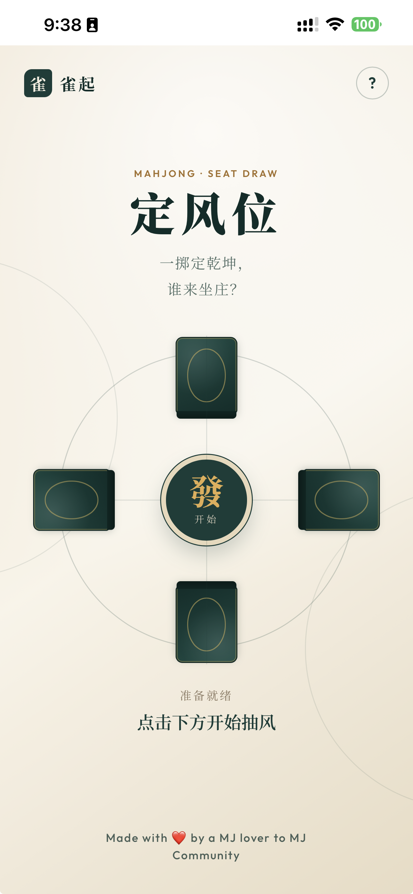
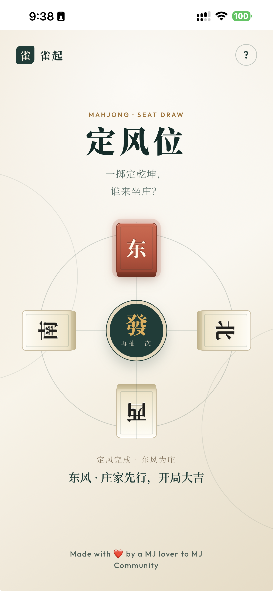
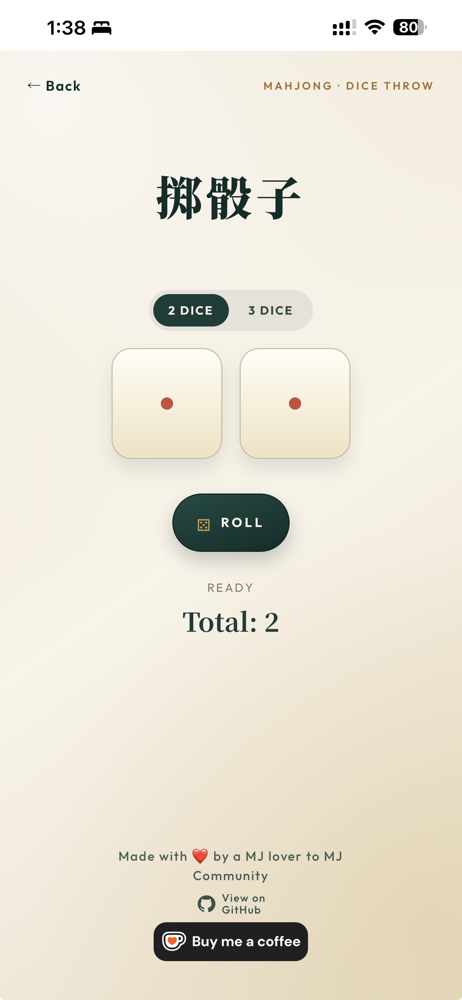

# mj-dw

> 雀起 - 定风位 - 一掷定乾坤，谁来坐庄？

	
	
	

## Launch on GitHub Pages

Open the live app here:

https://ubergoonz.github.io/mj-dw/

After opening the page:

1. Tap or click 發 in the center tile.
2. Wait for the reveal animation.
3. Read the result below the compass.
4. Tap or click 發 to draw again.

## Save the webpage as a shortcut on your mobile phone.

Depending on your mobile phone, you can save the webpage as a shortcut on your mobile phone and accessit to 打位。

## FAQs

1. Why create this app?

1A. When playing the 1st game using automatic table, have to spend some time to search for 東南西北。 This is wasting time. So I created this app, no need to destroy the 1st automatic arranged setup. Start faster and play more!

2. How does it work?

2A. The app uses a random number generator to generate a random direction and then use that as an input to the compass.

